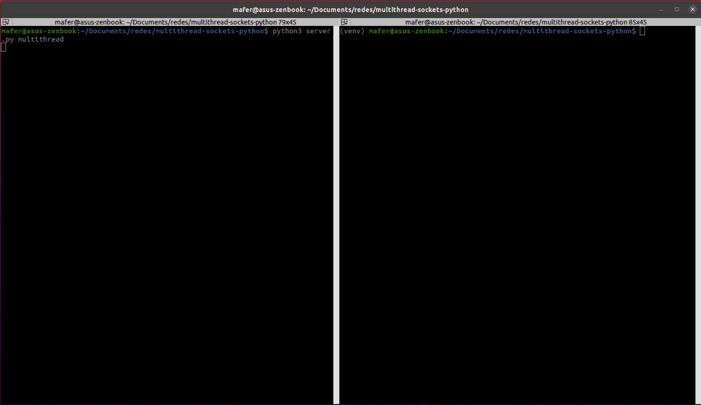
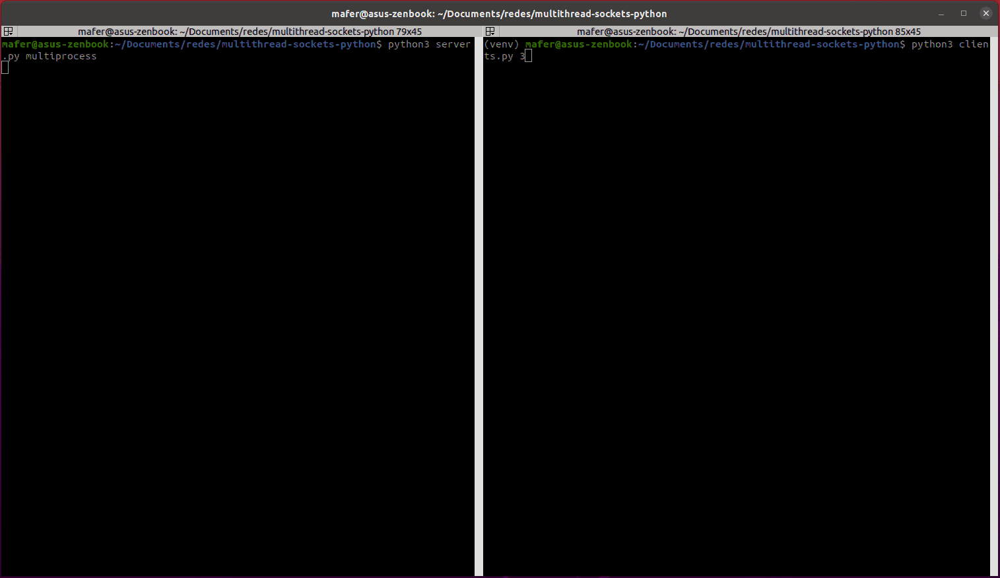

# 🌟 Multithread Sockets Python

This is the representation of a Client Server behavior using multithreading and multiprocessing in Python.

🧵 Multithread



🔨 Multiprocess




## 📌 Requirements

Python 3.X and Quotes

> To use the `quotes`, a pip library quotes was downloaded, it can be downloaded globally or in a virtual environment. 

> 👁 Note: Client is the only service that uses this library.

### Install quotes globally

```shell
pip install quotes
```

### If you want to create virtual enviroment

- Create it
```shell
python3 -m venv venv
```

- Activate it

    - Unix/macOS
    ```shell
    source venv/bin/activate
    ```
    
    - Windows
    ```shell
    ./venv\Script\activate
    ```

- Install requirement

```shell
pip install quotes
```

## 🔥 How to use


### 📡 Server

- 🧵 Multithread server
```shell
python3 server.py multithread

```

or

- 🔨 Multiprocess server
```shell
python3 server.py multiprocess

```

### 👧 Clients

Start clients
```shell
python3 clients.py <number_of_clients>

```
Each client sends two messages to the server